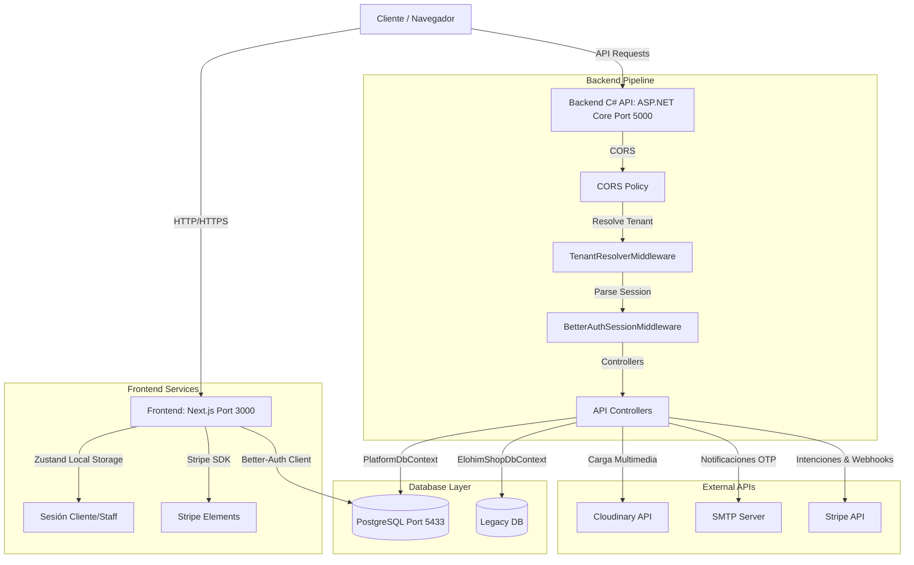

# DM Hub - Distributors Marketplace Hub

Plataforma unificada multi-tenant diseñada para digitalizar y gestionar operaciones comerciales de tiendas de distribución y logística, integrando un constructor visual de páginas web (Storefront), control de inventarios físicos por sucursal, pasarela de pagos integrada y reportes avanzados.

---

## 🛠️ Stack Tecnológico

[](https://nextjs.org/)
[](https://react.dev/)
[](https://zustand-demo.pmnd.rs/)
[](https://tailwindcss.com/)
[](https://better-auth.com/)
<br>
[](https://dotnet.microsoft.com/)
[](https://learn.microsoft.com/ef/core/)
[](https://www.postgresql.org/)
[](https://www.docker.com/)

---

## 📐 Arquitectura del Sistema

El siguiente diagrama detalla la arquitectura física y lógica del DMV Hub, ilustrando el flujo de peticiones desde el cliente hasta la base de datos y los servicios externos:



---

## 🌟 Características Destacadas

### 🎨 Constructor Visual (Storefront Builder)
* **Edición Visual Intuitiva**: Diseña la página de inicio del storefront con un editor de secciones tipo Shopify (anuncios, hero, grilla de productos, pie de página).
* **Exportar e Importar Diseños en JSON**: Ahora es posible exportar la configuración visual completa del diseño de tu tienda a un archivo local `.json` y volver a cargarlo mediante la función de importación para copias de seguridad rápidas, clonación o restauración del diseño.

### 📋 Tablero Kanban en Tiempo Real
* **Flujo Simplificado de Pedidos**: Pestaña dedicada dentro del portal para el personal (`cajero`, `administrador`, `superadmin`) para gestionar visualmente las reservaciones y pagos estructurados en 3 columnas clave:
  - **Pendiente de Pago**: Reservas que están pendientes de verificar su pago.
  - **Pago Verificado**: Pagos aprobados por el personal o procesados de manera exitosa.
  - **Despachado**: Pedidos que ya han sido empaquetados y enviados/entregados.
* **Drag & Drop Interactivo**: Mueve las tarjetas de pedidos entre las columnas del tablero usando gestos nativos de arrastrar y soltar.
* **Consulta en Tiempo Real (Real-time Polling)**: Actualización automática en segundo plano cada 6 segundos con contador visual e indicador de estado. El polling se pausa de forma inteligente al iniciar un arrastre para evitar colisiones de estado.
* **Alertas Auditivas Nativas**: Sistema de alertas sonoras y chimes interactivos generados en tiempo real con Web Audio API (sin dependencias de archivos externos) que avisan sobre nuevos pedidos entrantes y transiciones exitosas.

### 👥 Control de Acceso por Roles (RBAC)
La plataforma gestiona los permisos con un estricto control de acceso basado en roles para asegurar la operatividad diaria:

| Rol | Acceso Storefront | Dashboard & Sucursales | Gestión de Productos | Tablero Kanban & Pagos | Integraciones & Config |
| :--- | :---: | :---: | :---: | :---: | :---: |
| **Cliente** | ✅ Acceso total | ❌ Sin acceso | ❌ Sin acceso | ❌ Sin acceso | ❌ Sin acceso |
| **Cajero** | ✅ Acceso total | ✅ Solo lectura | ❌ Sin acceso | ✅ Control operativo | ❌ Sin acceso |
| **Administrador** | ✅ Acceso total | ✅ Acceso total | ✅ Gestión total | ✅ Control operativo | ✅ Config. de Tienda |
| **Super Admin** | ✅ Acceso total | ✅ Acceso global | ✅ Acceso global | ✅ Acceso global | ✅ Control global |

---

## 📂 Directorio de Documentación

Hemos reestructurado la documentación para mantenerla al día con el código refacturado. A continuación se presentan los enlaces a las guías detalladas de cada componente:

### Backend 🖥️
* 🗄️ **[DATABASE.md](backend/docs/DATABASE.md)**: Detalle del esquema PostgreSQL, los DbContexts (`PlatformDbContext` y `ElohimShopDbContext`), triggers automáticos para deducción de stock e inicializadores de semillas (seeders).
* 🔌 **[API.md](backend/docs/API.md)**: Listado completo de endpoints por controlador, estructuras de entrada (payloads), parámetros de consulta (query) y códigos de respuesta.
* 🌐 **[NETWORK.md](backend/docs/NETWORK.md)**: Flujo de red en C#, configuración de políticas de orígenes permitidos (CORS) y análisis del funcionamiento de los middlewares personalizados de detección de inquilinos (`TenantResolver`) y validación de sesiones (`BetterAuthSession`).

### Frontend 🎨
* 🔐 **[AUTHENTICATION.md](frontend/docs/AUTHENTICATION.md)**: Gestión de sesiones cliente/staff persistentes con Zustand y su integración directa mediante la tabla `session` de la base de datos.
* 🛣️ **[ROUTES.md](frontend/docs/ROUTES.md)**: Mapa de rutas, control de acceso basado en roles y protección mediante puertas de enlace reactivas (`ClientProtectedRoute` y `GuestAuthGate`).
* 🎨 **[STORE_BUILDER.md](frontend/docs/STORE_BUILDER.md)**: Estructura del constructor visual de páginas web, el esquema JSONB de configuración y el previsualizador responsivo.
* ⚙️ **[CONFIG_PAGE.md](frontend/docs/CONFIG_PAGE.md)**: Guía para configurar integraciones y credenciales de Stripe, Cloudinary y SMTP directamente desde el Portal.

---

## 🚀 Guía de Inicio Rápido (Docker)

El proyecto está dockerizado para poder ejecutarse en cualquier entorno local con Docker y Docker Compose instalado.

### 1. Clonar el repositorio con submódulos
```bash
git clone --recurse-submodules https://github.com/angc-labs/CC3090-inversiones-elohim-solution.git
cd CC3090-inversiones-elohim-solution
```

### 2. Configurar variables de entorno
Crea los archivos `.env` a partir de las plantillas provistas:
```bash
cp .env.example .env
cp backend/.env.example backend/.env
cp frontend/.env.example frontend/.env
```

### 3. Levantar la aplicación
```bash
docker compose up -d --build
```

El orquestador levantará tres contenedores principales:
* **Base de datos (db)**: Servidor PostgreSQL levantado en el puerto host `5433`.
* **API Backend (backend)**: Servidor de ASP.NET Core ejecutándose en el puerto `5000`.
* **Aplicación Frontend (frontend)**: Aplicación Next.js expuesta en el puerto `3000`.

### 4. Accesos útiles
* **Portal del Cliente / Administrador**: [http://localhost:3000](http://localhost:3000)
* **Documentación interactiva Swagger**: [http://localhost:5000/swagger](http://localhost:5000/swagger)
* **Cuenta Super Admin por Defecto**: `superadmin@dmhub.gt` / `SuperAdmin123!`
* **Cuentas Demo de Prueba** *(si `SEED_DATA=true`)*: `carlos.demo@dmhub.gt` / `Demo123!` o `cliente.demo@dmhub.gt` / `Demo123!`
* **Administrador Personalizado**: Configura las variables `SEED_USER_EMAIL` y `SEED_USER_PASSWORD` en el `.env` del backend para inicializar un usuario administrador específico en la plataforma durante el primer arranque.
